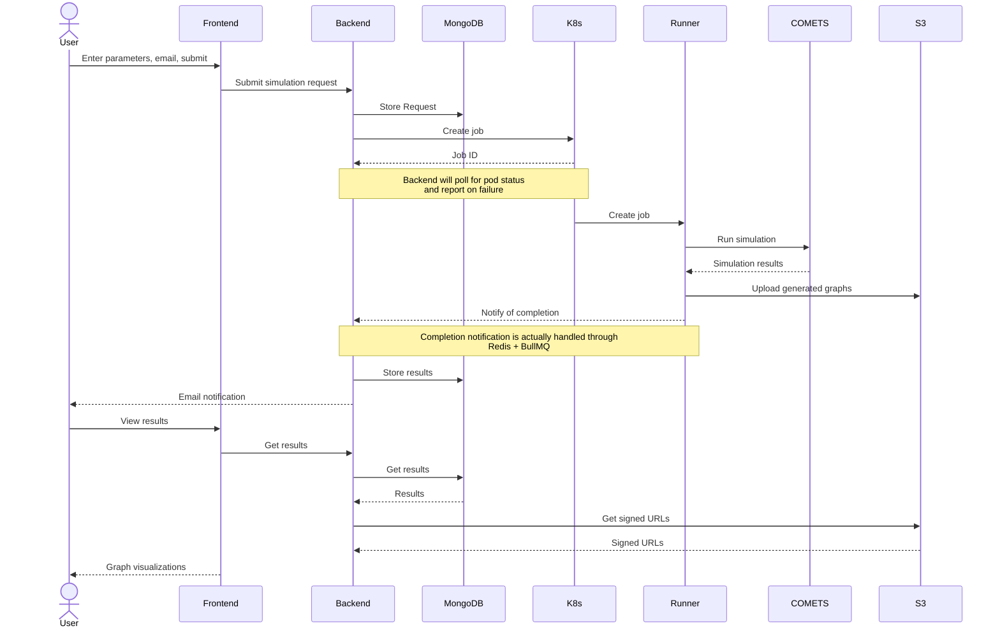

# COMETS-Web

## Introduction

This project was created in collaboration between the Software and Application Innovation Lab at Boston University and the Boston University faculty members, Ilija Dukovski and Daniel Segre, behind the cell biology simulation software COMETS. The goal of this collaboration was to enable running the COMETS software through a web interface.

This repository contains the code necessary for the website, backend logic, and COMETS runner. The website provides an interface for a subset of the COMETS parameters. Those parameters are then used to run a COMETS simulation within a Kubernetes job. The website then has the ability to display the resulting visualizations of the simulation.

## Software Organization

The code is divided into a frontend, backend, and runner which handles the major functionality of COMETS-web. Each have a README which covers the specifics of that package.

* [packages/backend](./packages/backend/README.md): Backend which keeps track of COMETS simulations and provides a means for the frontend to submit jobs and retrieve job results
* [packages/frontend](./packages/frontend/README.md): Frontend view which includes a form for capturing a subset of the COMETS simulation parameters as well as a means to visualize results.
* [packages/runner](./packages/runner/README.md): Wrapper around COMETS which allows for running the software with a container. Includes a CLI interface, supporting libraries, and Dockerfile for building a containerized COMETS instance.

## Features

* Submitting COMETS job for simulation
* Execution of COMETS simulation within Kubernetes Job
* Visualization of simulation results
* Email to user on job completion
* Email to maintainers on job failure

## Running Locally

The instructions for running each component are documented in their respective READMEs. For running the supporting software (MongoDB, Redis, Ngrok), refer to the instructions below.

### 1. Create Ngrok Account

Ngrok is needed to tunnel the local Redis connection. This enables having the COMETS runner notify the backend on competition through the locally running Redis instance.

* Signup for Ngrok [here](https://dashboard.ngrok.com/signup)
* Copy your auth token for the next step from [here](https://dashboard.ngrok.com/get-started/your-authtoken)

### 2. Make Configuration

* Navigate to `./local`
* Copy `.env.sample` to `.env`
* Fill out the `.env` file 

### 3. Start up Services

From `./local` run the command

```bash
docker compose up
```

### 4. Capture the Tunneled URL

Ngrok will have generated a tunnel for the Redis connection, this will change each time docker compose is run.

* Navigate to `localhost:4040` in the browser
* Copy the tunnel URL for later use

## System Overview

### Sample Usage




## Appendix

### Glossary

| Term             | Definition                                                   |
| ---------------- | ------------------------------------------------------------ |
| COMETS           | Computation Of Microbial Ecosystems in Time and Space        |
| COMETS-web       | Software in this repository which handles running COMETS in a web environment |
| Kubernetes (K8s) | Container management environment                             |
| NERC             | New England Research Cloud                                   |
| OpenShift        | Red Hat maintained Kubernetes cluster/environment            |

### Tech Stack

| Task                       | Tool           |
| -------------------------- | -------------- |
| Backend API Interface      | GraphQL        |
| Backend Framework          | NestJS         |
| Backend Language           | Typescript     |
| Database                   | MongoDB        |
| Deployment Environment     | NERC OpenShift |
| Frontend Component Library | MUI            |
| Frontend Form Library      | JSON Forms     |
| Frontend Framework         | React          |
| Frontend Language          | Typescript     |
| Job Runner                 | Kubernetes Job |
| Queue Database             | Redis          |
| Runner Language            | Python         |
| Runner Container           | Docker         |
| Work Queue Management      | BullMQ         |


